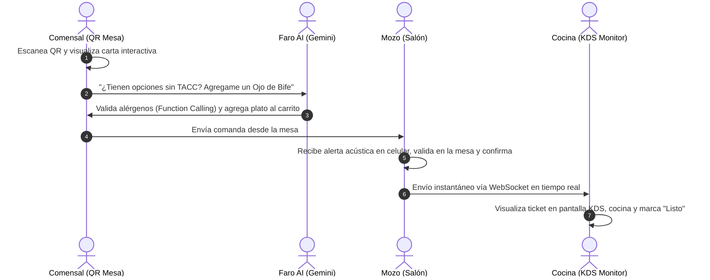

# 🍽️ Faro — Plataforma Integral para Restaurantes con IA Multimodal

> **Trabajo Práctico Integrador — Hito 1: Propuesta de Proyecto**  
> **Institución:** Universidad Tecnológica Nacional – Facultad Regional La Plata (UTN FRLP)  
> **Carrera:** Ingeniería en Sistemas de Información  
> **Asignatura:** Desarrollo de Software Cloud (2° Cuatrimestre 2026)  
> **Docentes:** Ing. Rafael Villalba | Ing. Matías Area  
> **Integrantes:**  
> - Sixto Javier Castro Cope — Legajo: 32797 — GitHub: [@62Javi](https://github.com/62Javi)  
> - Esteban Suarez — Legajo: 28077 — GitHub: [@Esteban-Suarez-hub](https://github.com/Esteban-Suarez-hub)  

---

## 🎯 Visión del Proyecto y Problemática

En el sector gastronómico conviven problemas constantes:
1. **Menús estáticos o desactualizados:** Cartas en PDFs incómodos sin fotos ni control de stock.
2. **Falta de tiempo del personal para asesorar:** Demoras al consultar platos sin TACC, celiaquía o maridajes en picos de salón.
3. **Falta de métricas estratégicas:** Decisiones de compra basadas en intuición y no en datos de ventas reales.

**Faro** digitaliza y conecta todo el circuito entre **Dueño**, **Comensal (sin app/registro)**, **Mozo en Salón** y **Cocina en Tiempo Real**.

---

## 🚀 Arquitectura y Tecnologías Cloud Utilizadas

| Componente | Tecnología | Rol / Funcionalidad |
| :--- | :--- | :--- |
| **Frontend** | **Next.js (React) + TailwindCSS** | Interfaz web responsiva para comensales, mozos, cocina y dueño. |
| **Backend** | **FastAPI (Python 3.13)** | API REST contenerizada en Google Cloud Run + WebSockets en vivo. |
| **IA Multimodal** | **Google Gemini** | **Structured Outputs** (extracción OCR de cartas físicas en PDF/Foto) y **Function Calling** (Asistente sommelier interactivo en mesa). |
| **Base de Datos & Storage** | **Supabase (PostgreSQL)** | Almacenamiento relacional de cartas, mesas, comandas y buckets de fotos. |
| **Autenticación & Roles** | **Clerk** | Gestión multi-tenant de restaurantes y roles (`dueño`, `mozo`, `cocina`). |
| **Contenedorización** | **Docker & Docker Compose** | Despliegue en Google Cloud Run y Vercel. |

---

## 🧭 Flujo de Funcionamiento



---

## 📦 Estructura del Repositorio

```
project-faro/
├── backend/
│   ├── app/
│   │   ├── api/
│   │   │   ├── endpoints/
│   │   │   │   ├── ai.py              # Gemini OCR & Function Calling Chat
│   │   │   │   ├── menu.py            # CRUD de platos y categorías
│   │   │   │   ├── orders.py          # Gestión del ciclo de vida de comandas
│   │   │   │   ├── tables.py          # Generador de Códigos QR por mesa
│   │   │   │   ├── metrics.py         # Dashboard analítico para dueños
│   │   │   │   ├── websocket.py       # WebSockets en vivo para cocina y mozos
│   │   │   │   └── auth.py            # Clerk multi-tenant auth
│   │   │   └── router.py
│   │   ├── core/
│   │   │   ├── config.py              # Settings y variables de entorno
│   │   │   ├── gemini.py              # Cliente Gemini + Tool declarations
│   │   │   └── supabase.py            # Cliente Supabase + In-memory turnkey store
│   │   ├── models/schemas.py          # Esquemas Pydantic completos
│   │   ├── services/
│   │   │   ├── ai_agent.py            # Sommelier virtual con Function Calling
│   │   │   ├── menu_extractor.py      # Extracción multimodal Structured Outputs
│   │   │   └── order_service.py       # Transiciones de estado y broadcast
│   │   └── main.py                    # Entrypoint FastAPI
│   ├── supabase/
│   │   ├── migrations/001_initial_schema.sql
│   │   └── seed.sql
│   ├── Dockerfile
│   └── requirements.txt
├── frontend/
│   ├── src/
│   │   ├── app/
│   │   │   ├── page.tsx               # Landing informativa & selectores de rol
│   │   │   ├── menu/[restaurantId]/   # Menú interactivo comensal + QR + Faro AI
│   │   │   ├── admin/                 # Dashboard métricas & Carga de carta con IA
│   │   │   ├── waiter/                # App mozo con validación y confirmación
│   │   │   └── kitchen/               # KDS Monitor de Cocina con WebSockets
│   │   ├── components/
│   │   │   ├── ai/                    # AiChatAssistant & MenuUploadModal
│   │   │   ├── menu/                  # DishCard, CategoryNav, CartDrawer
│   │   │   ├── waiter/                # WaiterOrderCard
│   │   │   ├── kitchen/               # OrderTicket
│   │   │   └── admin/                 # MetricsOverview & QRCodeCard
│   │   └── hooks/                     # useCart, useWebSocket
│   ├── Dockerfile
│   └── package.json
├── docker-compose.yml
└── README.md
```

---

## ⚡ Guía de Ejecución Local

### 1. Backend (FastAPI + WebSockets)
```bash
cd backend
# Activar entorno virtual
.\venv\Scripts\activate   # En Windows
# Iniciar servidor
python -m uvicorn app.main:app --reload --port 8000
```
La API estará disponible en `http://localhost:8000` y la documentación interactiva Swagger en `http://localhost:8000/docs`.

### 2. Frontend (Next.js 14 + Tailwind)
```bash
cd frontend
npm run dev
```
La aplicación web estará disponible en `http://localhost:3000`.

### 3. Con Docker Compose
```bash
docker-compose up --build
```