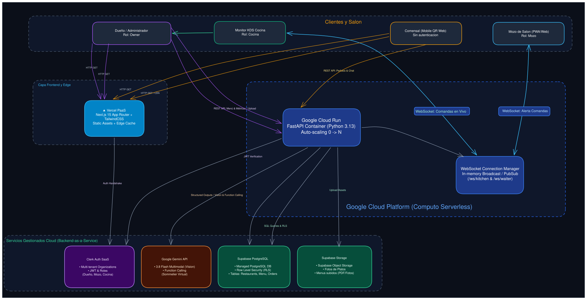

# Faro — Plataforma Integral para Restaurantes con IA Multimodal

> **Trabajo Práctico Integrador — Hito 1: Propuesta de Proyecto**  
> **Institución:** Universidad Tecnológica Nacional – Facultad Regional La Plata (UTN FRLP)  
> **Carrera:** Ingeniería en Sistemas de Información  
> **Asignatura:** Desarrollo de Software Cloud (2° Cuatrimestre 2026)  
> **Docentes:** Ing. Rafael Villalba | Ing. Matías Area  
> **Integrantes:**  
> - Sixto Javier Castro Cope — Legajo: 32797 — GitHub: [@62Javi](https://github.com/62Javi)  
> - Esteban Suarez — Legajo: 28077 — GitHub: [@Esteban-Suarez-hub](https://github.com/Esteban-Suarez-hub)  

---

## 1. Contexto y Problemática del Negocio

En la operatoria gastronómica actual persisten fricciones operativas y de experiencia de usuario:
1. **Cartas físicas y archivos PDF estáticos:** Dificultad para reflejar variaciones de precios, cambios de stock diario o platos del día, requiriendo reimpresiones costosas o descargas incómodas para los clientes.
2. **Consultas de alta demanda sobre alérgenos e ingredientes:** Demoras en la atención en horarios pico ante consultas específicas (celiaquía/sin TACC, intolerancia a la lactosa, requerimientos vegetarianos/veganos o maridajes recomendados).
3. **Desconexión entre salón y cocina:** Comandas manuscritas o sistemas rígidos que ralentizan la comunicación en tiempo real entre mozos y personal de cocina.
4. **Falta de analítica transaccional consolidada:** Dificultad de los dueños para disponer de métricas de rotación de platos y recaudación en tiempo real.

**Faro** articula todo el ciclo operativo unificando comensales (acceso web directo vía QR sin instalación de aplicaciones), mozos en salón, monitor KDS de cocina y panel de administración en una arquitectura cloud desacoplada y reactiva.

---

## 2. Diagrama de Arquitectura Cloud



---

## 3. Instrucciones de Ejecución Local

### Requisitos previos
- Python 3.11 o superior.
- Node.js 18 o superior con npm.
- Docker y Docker Compose (opcional para ejecución contenerizada).

### Opción A: Ejecución mediante Docker Compose
```bash
# Construcción y arranque coordinado de servicios
docker-compose up --build
```
- Aplicación web: `http://localhost:3000`
- API backend: `http://localhost:8000`
- Documentación OpenAPI / Swagger: `http://localhost:8000/docs`

### Opción B: Ejecución modular directa

#### 1. Backend (FastAPI)
```bash
cd backend
python -m venv venv
source venv/bin/activate       # En Linux / macOS
# venv\Scripts\activate       # En Windows
pip install -r requirements.txt
python -m uvicorn app.main:app --reload --port 8000
```

#### 2. Frontend (Next.js)
```bash
cd frontend
npm install
npm run dev
```
Acceder a `http://localhost:3000` para operar las interfaces de salón, cocina y administración.