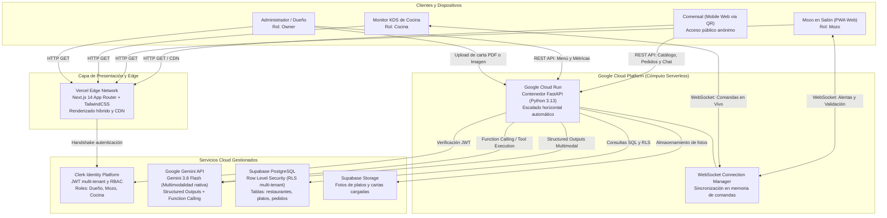
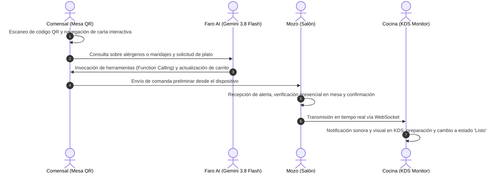

# Faro — Plataforma Integral para Restaurantes con IA Multimodal

> **Trabajo Práctico Integrador — Hito 1: Propuesta de Proyecto**  
> **Institución:** Universidad Tecnológica Nacional – Facultad Regional La Plata (UTN FRLP)  
> **Carrera:** Ingeniería en Sistemas de Información  
> **Asignatura:** Desarrollo de Software Cloud (2° Cuatrimestre 2026)  
> **Docentes:** Ing. Rafael Villalba | Ing. Matías Area  
> **Integrantes:**  
> - Sixto Javier Castro Cope — Legajo: 32797 — GitHub: [@62Javi](https://github.com/62Javi)  
> - Esteban Suarez — Legajo: 28077 — GitHub: [@Esteban-Suarez-hub](https://github.com/Esteban-Suarez-hub)  

---

## 1. Contexto y Problemática del Negocio

En la operatoria gastronómica actual persisten fricciones operativas y de experiencia de usuario:
1. **Cartas físicas y archivos PDF estáticos:** Dificultad para reflejar variaciones de precios, cambios de stock diario o platos del día, requiriendo reimpresiones costosas o descargas incómodas para los clientes.
2. **Consultas de alta demanda sobre alérgenos e ingredientes:** Demoras en la atención en horarios pico ante consultas específicas (celiaquía/sin TACC, intolerancia a la lactosa, requerimientos vegetarianos/veganos o maridajes recomendados).
3. **Desconexión entre salón y cocina:** Comandas manuscritas o sistemas rígidos que ralentizan la comunicación en tiempo real entre mozos y personal de cocina.
4. **Falta de analítica transaccional consolidada:** Dificultad de los dueños para disponer de métricas de rotación de platos y recaudación en tiempo real.

**Faro** articula todo el ciclo operativo unificando comensales (acceso web directo vía QR sin instalación de aplicaciones), mozos en salón, monitor KDS de cocina y panel de administración en una arquitectura cloud desacoplada y reactiva.

---

## 2. Arquitectura de la Solución y Stack Tecnológico

| Capa / Componente | Tecnología Seleccionada | Rol en la Arquitectura |
| :--- | :--- | :--- |
| **Frontend & Edge** | **Next.js 14 (App Router) + TailwindCSS** en **Vercel** | Aplicación web responsiva para comensales (sin registro previo), panel PWA para personal de salón, monitor KDS de cocina y dashboard de gestión de menú. |
| **Backend & Cómputo** | **FastAPI (Python 3.13)** en **Google Cloud Run** | API REST y servidor de WebSockets contenerizado serverless con escalabilidad automática basada en demanda. |
| **Inteligencia Artificial Multimodal** | **Google Gemini (Gemini 3.8 Flash / 3.6 Flash)** | Ingesta y digitalización de cartas impresas mediante procesamiento visual nativo con **Structured Outputs** (JSON Schema tipado vía Pydantic) y asistencia al comensal mediante **Function Calling** transaccional con validación de precios en servidor. |
| **Persistencia y Datos** | **Supabase (PostgreSQL 15 + Object Storage)** | Base de datos relacional gestionada con políticas de seguridad a nivel de fila (Row Level Security multi-tenant) y almacenamiento de activos multimedia. |
| **Autenticación y Control de Acceso** | **Clerk Auth** | Gestión de identidades federadas, sesiones seguras y control de acceso basado en roles (`admin/dueño`, `mozo`, `cocina`). |
| **Auditoría de Decisiones Técnicas** | **AI-DECISIONS.md** | Registro cronológico auditado de intervenciones de IA, prompts, validaciones arquitectónicas y mitigación de fallos. |

### Diagrama de Arquitectura Cloud



---

## 3. Flujo Operativo y de Sincronización



---

## 4. Estructura del Repositorio

```
project-faro/
├── backend/
│   ├── app/
│   │   ├── api/
│   │   │   ├── endpoints/
│   │   │   │   ├── ai.py              # Inferencia multimodal y chat con Function Calling
│   │   │   │   ├── menu.py            # Endpoints de gestión de platos y categorías
│   │   │   │   ├── orders.py          # Ciclo de vida y estados de comandas
│   │   │   │   ├── tables.py          # Generador de códigos QR por mesa
│   │   │   │   ├── metrics.py         # Métricas de facturación y rotación
│   │   │   │   ├── websocket.py       # Canales WebSocket de salón y cocina
│   │   │   │   └── auth.py            # Integración de tokens Clerk
│   │   │   └── router.py              # Agregador de rutas FastAPI
│   │   ├── core/
│   │   │   ├── config.py              # Configuración y variables de entorno
│   │   │   ├── gemini.py              # Cliente Gemini y declaraciones de herramientas
│   │   │   └── supabase.py            # Conexión Supabase y almacén local de contingencia
│   │   ├── models/schemas.py          # Modelos de datos y esquemas Pydantic
│   │   ├── services/
│   │   │   ├── ai_agent.py            # Orquestación del sommelier con Function Calling
│   │   │   ├── menu_extractor.py      # Digitalización multimodal con Structured Outputs
│   │   │   └── order_service.py       # Lógica transaccional de comandas y broadcast
│   │   └── main.py                    # Punto de entrada de la aplicación FastAPI
│   ├── supabase/
│   │   ├── migrations/001_initial_schema.sql
│   │   └── seed.sql
│   ├── Dockerfile
│   └── requirements.txt
├── frontend/
│   ├── src/
│   │   ├── app/
│   │   │   ├── page.tsx               # Portada e ingreso por roles
│   │   │   ├── menu/[restaurantId]/   # Carta interactiva, QR y chat de mesa
│   │   │   ├── admin/                 # Panel de métricas y digitalización de menús
│   │   │   ├── waiter/                # Interfaz de mozo para validación de pedidos
│   │   │   └── kitchen/               # Monitor KDS de cocina con alertas sonoras
│   │   ├── components/
│   │   │   ├── ai/                    # Componentes de interacción con IA
│   │   │   ├── menu/                  # Renderizado de platos, filtros y carrito
│   │   │   ├── waiter/                # Tarjetas de pedido de salón
│   │   │   └── kitchen/               # Comandas en tiempo real
│   │   └── hooks/                     # Custom hooks (useCart, useWebSocket)
│   ├── Dockerfile
│   └── package.json
├── docker-compose.yml
├── AI-DECISIONS.md
└── README.md
```

---

## 5. Instrucciones de Ejecución Local

### Requisitos previos
- Python 3.11 o superior.
- Node.js 18 o superior con npm.
- Docker y Docker Compose (opcional para ejecución contenerizada).

### Opción A: Ejecución mediante Docker Compose
```bash
# Construcción y arranque coordinado de servicios
docker-compose up --build
```
- Aplicación web: `http://localhost:3000`
- API backend: `http://localhost:8000`
- Documentación OpenAPI / Swagger: `http://localhost:8000/docs`

### Opción B: Ejecución modular directa

#### 1. Backend (FastAPI)
```bash
cd backend
python -m venv venv
source venv/bin/activate       # En Linux / macOS
# venv\Scripts\activate       # En Windows
pip install -r requirements.txt
python -m uvicorn app.main:app --reload --port 8000
```

#### 2. Frontend (Next.js)
```bash
cd frontend
npm install
npm run dev
```
Acceder a `http://localhost:3000` para operar las interfaces de salón, cocina y administración.